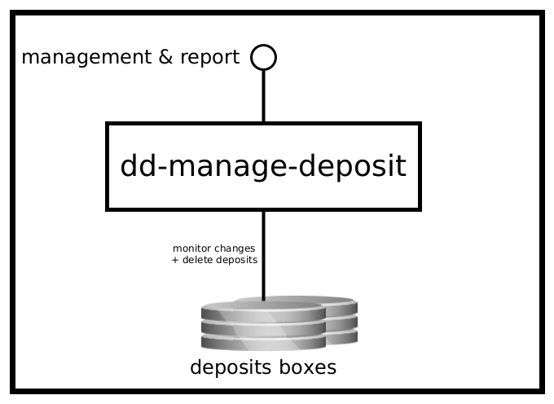

dd-manage-deposit
=================

Service that manages and maintains information about deposits in a deposit area


SYNOPSIS
--------

    dd-manage-deposit { server | check }


DESCRIPTION
-----------

### Purpose and context
Service that manages and maintains information about deposits in a deposit area. A deposit area is a collection of directories
that are used to receive and process deposits. See also: [deposit-directory], [dd-sword2], [dd-ingest-flow].

### Interfaces

The service has the following interfaces.

{:width=50%}

#### Management & Report

* _Protocol type_: HTTP
* _Internal or external_: **internal**
* _Purpose_: Generating deposit reports and cleaning up the deposit area.

See [API](./to-api.md) for details.

#### Deposit boxes

* _Protocol type_: Shared filesystem
* _Internal or external_: **internal**
* _Purpose_: Monitoring changes in the contents of the deposit boxes and keeping the information in the database in sync.

ARGUMENTS
---------

        positional arguments:
        {server,check}         available commands
        
        named arguments:
        -h, --help             show this help message and exit
        -v, --version          show the application version and exit

EXAMPLES
--------

<!-- Add examples of invoking this module from the command line or via HTTP other interfaces -->
    

INSTALLATION AND CONFIGURATION
------------------------------
Currently, this project is built as an RPM package for RHEL8/Rocky8 and later. The RPM will install the binaries to
`/opt/dans.knaw.nl/dd-manage-deposit` and the configuration files to `/etc/opt/dans.knaw.nl/dd-manage-deposit`. 

For installation on systems that do no support RPM and/or systemd:

1. Build the tarball (see next section).
2. Extract it to some location on your system, for example `/opt/dans.knaw.nl/dd-manage-deposit`.
3. Start the service with the following command
   ```
   /opt/dans.knaw.nl/dd-manage-deposit/bin/dd-manage-deposit server /opt/dans.knaw.nl/dd-manage-deposit/cfg/config.yml 
   ```

BUILDING FROM SOURCE
--------------------
Prerequisites:

* Java 11 or higher
* Maven 3.3.3 or higher
* RPM

Steps:
    
    git clone https://github.com/DANS-KNAW/dd-manage-deposit.git
    cd dd-manage-deposit 
    mvn clean install

If the `rpm` executable is found at `/usr/local/bin/rpm`, the build profile that includes the RPM 
packaging will be activated. If `rpm` is available, but at a different path, then activate it by using
Maven's `-P` switch: `mvn -Pprm install`.

Alternatively, to build the tarball execute:

    mvn clean install assembly:single

[deposit-directory]: https://dans-knaw.github.io/dans-datastation-architecture/deposit-directory/
[dd-sword2]: https://dans-knaw.github.io/dans-datastation-architecture/#dd-sword2
[dd-ingest-flow]: https://dans-knaw.github.io/dans-datastation-architecture/#dd-ingest-flow
